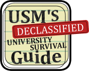
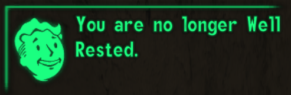

 

    
    <h2>Manual de supervivencia para informáticos USM</h2>

# Introducción

El presente documento es un proyecto personal desarrollado en busca de orientar y abarcar la mayor cantidad de información posible acerca de la universidad. No tiene ninguna relación con centros de estudiantes ni entidades de la universidad, pues es una guía por alumnos y para alumnos, en donde se recopiló información y comentarios de forma manual <strike>a costa del sudor, lágrimas y otros fluidos de su creador</strike>. Es material no oficial, téngalo en cuenta.

    

 

Bienvenidos a la universidad. Probablemente hayan pasado por un largo y tedioso proceso para poder llegar hasta acá, pero lamentamos decirles que lo anterior fue solo el cierre de un ciclo. Se viene una nueva etapa, nuevos desafíos y nuevas experiencias de todo tipo (uff).
Esperamos hayan tenido unas buenas vacaciones porque esto está recién comenzando (eeeeee). Al principio será difícil, pero de uds depende que logren ∫integrarse y pasarla bien durante su vida universitaria.

	Bienvenidos sansanos y prepare your anus



[1]: https://docs.google.com/document/d/1ZORkRBDfVD3lYEzETasc74sJj7cdgy6oqHFKpqUJSgc/edit

